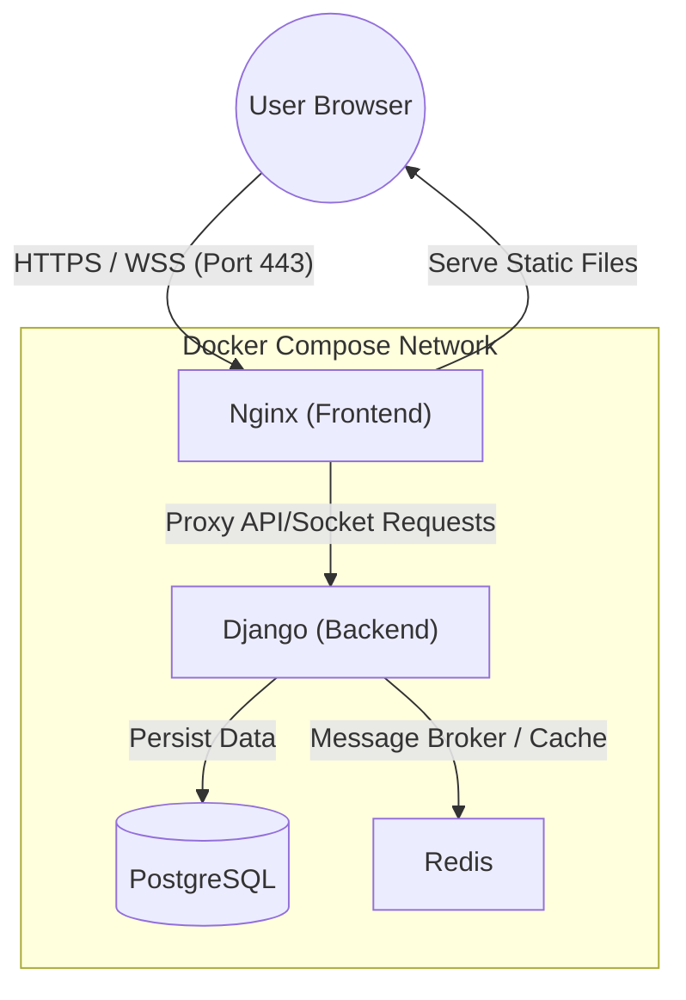

# GalaxyPong

GalaxyPong is a web service providing real-time 3D table tennis games and chat features. It utilizes Django, Vanilla JS, and Three.js to offer an immersive gaming experience and social functions.

[](https://www.youtube.com/watch?v=ukZn_TD_ego)

> Click the image to watch the demo video.

---

## Tech Stack

### Backend
- **Framework**: Django, Django Channels
- **Database**: PostgreSQL
- **Cache/Message Broker**: Redis
- **Server**: Daphne (ASGI)

### Frontend
- **Language**: Vanilla JavaScript
- **Graphics**: Three.js (3D Rendering)
- **Web Server**: Nginx

### Infrastructure
- **Container**: Docker, Docker Compose
- **Orchestration**: Makefile for easy management

---

## System Architecture



## Key Features

- **Real-time Game**: 3D table tennis match using Three.js.
- **Chat System**: Real-time messaging and chat room management.
- **User Management**: Sign up, login, profile management, and match history.
- **Responsive UI**: Interface optimized for various screen sizes.

---

## Getting Started

### Prerequisites
- Docker and Docker Compose must be installed.
- Create a `.env` file in the root directory. (Refer to `.example_env`)

### Installation & Execution

1. **Clone Repository**
   ```bash
   git clone https://github.com/your-repo/GalaxyPong.git
   cd GalaxyPong
   ```

2. **Setup Environment Variables**
   ```bash
   cp .example_env .env
   # Modify environment variables as needed
   ```

3. **Run Project**
   ```bash
   make up
   ```
   Once the service is ready, you can access it at `https://localhost`. (May vary depending on Nginx configuration)

### Management Commands (Makefile)

- `make up`: Build and run containers in background
- `make down`: Stop containers
- `make clean`: Remove containers and volumes
- `make fclean`: Completely reset project state (Caution: deletes data)
- `make migrate`: Apply database migrations

---

## Project Structure

```text
.
├── backend/          # Django based API and Socket Server
├── frontend/         # Nginx and Static Web Resources (HTML/JS)
├── docker-compose.yml
└── makefile
```
